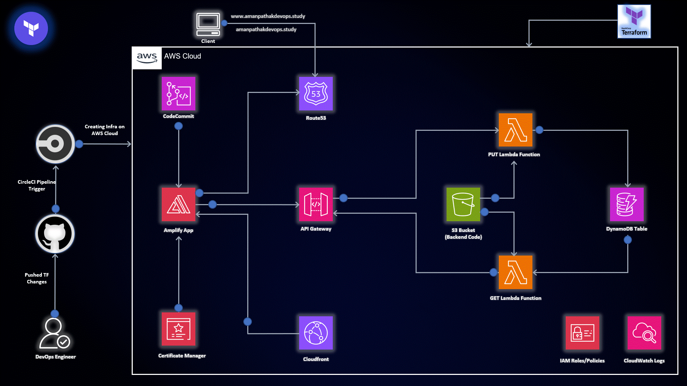
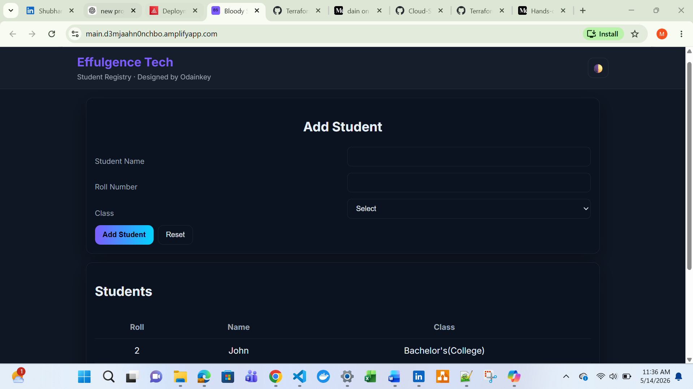
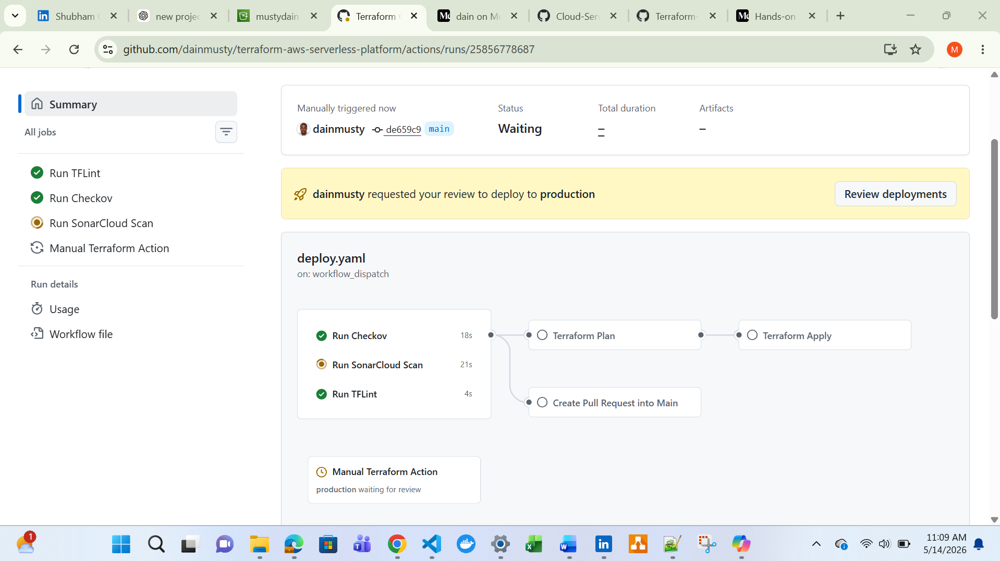
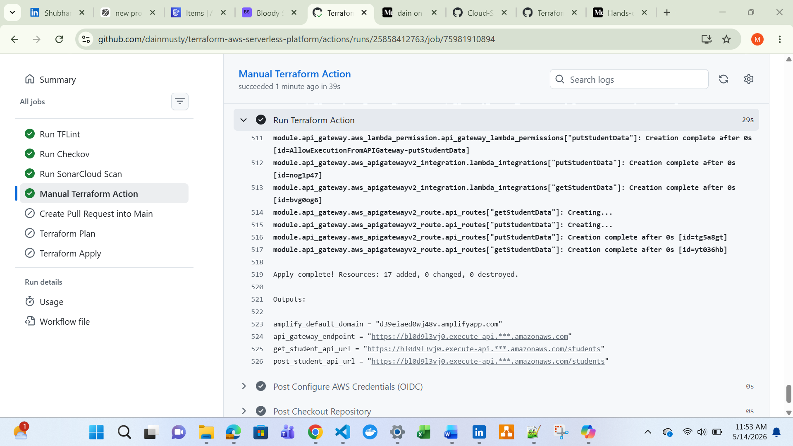
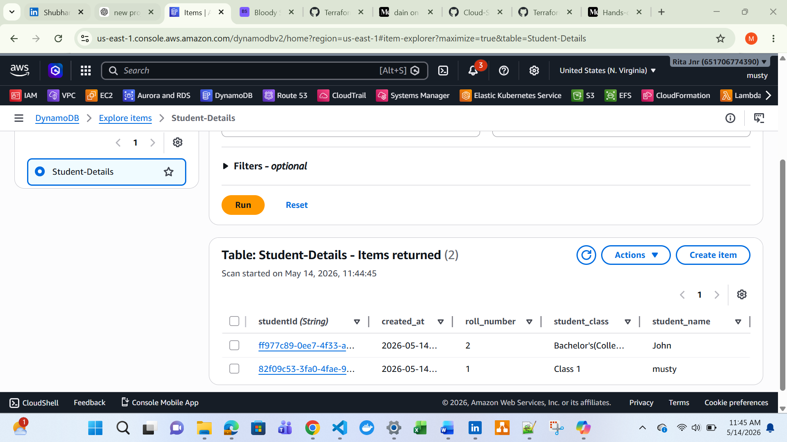
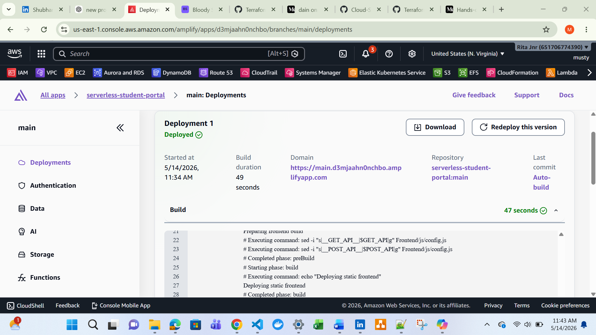

# Serverless Student Portal on AWS

[](https://www.linkedin.com/in/odainkey-mustapha)
[](https://github.com/dainmusty/terraform-aws-serverless-platform)
[](https://www.serverless.com)
[](https://aws.amazon.com)
[](https://www.terraform.io)

Welcome to the AWS Serverless Student Registry Platform — a full-stack cloud-native project designed to demonstrate modern serverless architecture on AWS. This project showcases how frontend and backend services can be seamlessly integrated using AWS Amplify, API Gateway, Lambda, DynamoDB, CloudFront, Route53, and Terraform, while implementing CI/CD and DevSecOps best practices with GitHub Actions.













---

# Table of Contents

* [Overview](#overview)
* [Architecture](#architecture)
* [AWS Services Used](#aws-services-used)
* [Features](#features)
* [Project Structure](#project-structure)
* [Infrastructure Components](#infrastructure-components)
* [CI/CD Pipeline](#cicd-pipeline)
* [Workflow Strategy](#workflow-strategy)
* [Terraform Highlights](#terraform-highlights)
* [Security Best Practices Implemented](#security-best-practices-implemented)
* [Lessons Learned](#lessons-learned)
* [Future Improvements](#future-improvements)
* [How to Deploy](#how-to-deploy)
* [GitHub Secrets Required](#github-secrets-required)
* [Screenshots](#screenshots)
* [Author](#author)
* [Conclusion](#conclusion)

---

## Overview

This project demonstrates a fully serverless student management platform built on AWS using Infrastructure as Code (Terraform), GitHub Actions CI/CD, and DevSecOps best practices.

The application allows users to:

* Add student records through a web interface
* Store student data in DynamoDB
* Retrieve and display student data dynamically
* Deploy infrastructure automatically using GitHub Actions
* Host the frontend using AWS Amplify
* Expose backend services through API Gateway and Lambda

The project follows modular Terraform architecture and modern cloud-native deployment practices.

---

# Architecture

## High-Level Workflow

1. User accesses the frontend application hosted on AWS Amplify.
2. Frontend JavaScript calls API Gateway endpoints.
3. API Gateway invokes AWS Lambda functions.
4. Lambda functions interact with DynamoDB.
5. Student data is stored and retrieved dynamically.
6. GitHub Actions automates validation, scanning, planning, and deployment.

---

# AWS Services Used

## Core Services

* AWS Amplify
* AWS Lambda
* Amazon API Gateway (HTTP API)
* Amazon DynamoDB
* Amazon CloudWatch
* AWS IAM

## Networking & Security

* Amazon Route 53
* AWS Certificate Manager (ACM)
* Amazon CloudFront

## DevOps & Automation

* GitHub Actions
* Terraform
* OIDC Federation

## DevSecOps Tools

* TFLint
* Checkov
* SonarCloud

---

# Features

* Fully serverless architecture
* Terraform modular design
* GitHub Actions CI/CD pipeline
* DevSecOps security scanning
* OIDC authentication for GitHub Actions
* Automatic Terraform deployments
* Manual Terraform apply/destroy workflows
* Production environment approval protection
* Dynamic frontend API injection
* Responsive frontend UI
* DynamoDB integration
* CloudWatch logging
* API Gateway routing
* Secure IAM least privilege model

---

# Project Structure

```text
terraform-aws-serverless-platform/
│
├── Frontend/
│   ├── css/
│   ├── js/
│   ├── images/
│   ├── config.js
│   └── index.html
│
├── terraform/
│   ├── environments/
│   │   ├── shared/
│   │   └── dev/
│   │
│   └── modules/
│       ├── amplify/
│       ├── api_gateway/
│       ├── cloudfront/
│       ├── dynamodb/
│       ├── iam/
│       ├── lambda/
│       ├── route53/
│       └── acm/
│
├── lambda/
│   ├── GETmethod.py
│   └── POSTmethod.py
│
└── .github/workflows/
    └── terraform.yml
```

---

# Infrastructure Components

## Frontend Layer

### AWS Amplify

Hosts the static frontend application.

### CloudFront

Provides global caching and low latency delivery.

### Route53

Provides DNS management for the custom domain.

### ACM

Provides SSL/TLS certificates for HTTPS.

---

## Backend Layer

### API Gateway

Exposes RESTful HTTP endpoints.

Endpoints:

```text
GET  /students
POST /students
```

### AWS Lambda

Handles backend business logic.

Functions:

* Get student records
* Add student records

### DynamoDB

Stores student records.

Example item structure:

```json
{
  "studentId": "12345",
  "roll_number": "1",
  "student_name": "Musty",
  "student_class": "DevOps"
}
```

---

# CI/CD Pipeline

## GitHub Actions Workflow

The CI/CD pipeline performs:

### Code Quality & Security

* TFLint
* Checkov
* SonarCloud

### Infrastructure Deployment

* Terraform Init
* Terraform Plan
* Terraform Apply
* Terraform Destroy (manual only)

### Security

* GitHub OIDC authentication
* IAM role assumption
* Environment approval protection

---

# Workflow Strategy

## Development Flow

```text
Developer → dev branch → Security scans → Auto PR → main branch
```

## Production Deployment Flow

```text
Merge into main → Terraform Apply → AWS Deployment
```

## Manual Workflow Support

Supports:

* terraform plan
* terraform apply
* terraform destroy

with manual approval protection.

---

# Terraform Highlights

## Modular Architecture

Infrastructure is separated into reusable modules:

* Amplify Module
* API Gateway Module
* IAM Module
* Lambda Module
* DynamoDB Module
* CloudFront Module
* ACM Module
* Route53 Module

## Benefits

* Reusability
* Scalability
* Maintainability
* Easier troubleshooting
* Environment consistency

---

# Security Best Practices Implemented

* Least privilege IAM policies
* OIDC federation instead of static AWS keys
* GitHub environment protection rules
* Infrastructure security scanning with Checkov
* Code quality scanning with SonarCloud
* Terraform linting with TFLint
* HTTPS with ACM certificates
* CloudFront edge protection

---

# Lessons Learned

## Key Takeaways

### 1. IAM Permissions Are Critical

Terraform deployment pipelines require broader permissions than Lambda runtime permissions.

### 2. API Gateway Route Naming Must Match Exactly

Small naming inconsistencies between:

* Terraform routes
* Lambda handlers
* Frontend API calls

can break integrations.

### 3. DynamoDB Partition Keys Must Match Lambda Payloads

The DynamoDB schema and Lambda item structure must align perfectly.

### 4. Amplify Build Paths Are Case Sensitive

Frontend folder naming issues caused deployment failures.

### 5. OIDC Is Better Than Static AWS Credentials

GitHub OIDC federation provides a more secure and scalable CI/CD authentication model.

### 6. CloudWatch Logs Are Essential

CloudWatch logs significantly simplified debugging Lambda and API Gateway issues.

### 7. Incremental Troubleshooting Works Best

Breaking down problems layer-by-layer helped isolate issues faster:

* Frontend
* API Gateway
* Lambda
* DynamoDB
* IAM
* CI/CD

---

# Future Improvements

Potential enhancements:

* Multi-environment deployments (dev/stage/prod)
* WAF integration
* Cognito authentication
* Terraform remote backend
* ArgoCD GitOps integration
* EKS migration
* Monitoring dashboards with Grafana
* Prometheus integration
* Centralized logging
* Blue/Green deployments
* Lambda authorizers

---

# How to Deploy

## Prerequisites

* AWS Account
* Terraform
* GitHub Repository
* GitHub Secrets configured
* OIDC IAM role configured

---

## Clone Repository

```bash
git clone https://github.com/dainmusty/terraform-aws-serverless-platform.git
```

---

## Terraform Deployment

```bash
cd terraform/environments/dev

terraform init
terraform plan
terraform apply
```

---

# GitHub Secrets Required

```text
AWS_REGION
TERRAFORM_ROLE_ARN
SONAR_TOKEN
```

---

# Screenshots

Recommended screenshots to include:

* Amplify deployment
* GitHub Actions workflow success
* DynamoDB entries
* API Gateway routes
* CloudWatch logs
* Frontend UI
* Terraform apply output
* SonarCloud results
* Checkov scans

---

# Author

## Odainkey 

Cloud & DevOps Engineer

Focus Areas:

* AWS Cloud Engineering
* Terraform
* Kubernetes
* DevSecOps
* CI/CD Automation
* Serverless Architecture
* Observability
* GitOps

GitHub:

[https://github.com/dainmusty](https://github.com/dainmusty)

---

# Conclusion

This project demonstrates how modern serverless applications can be deployed securely and automatically using:

* AWS
* Terraform
* GitHub Actions
* DevSecOps tooling
* OIDC authentication
* Modular Infrastructure as Code

while following production-oriented cloud engineering practices.
